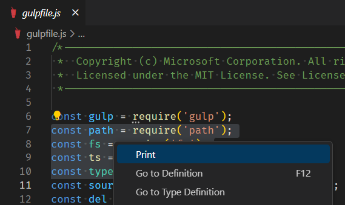

1. Otevřete soubor pro úpravy a zaměřte editor. 
2. Vytvořte víceřádkový výběr.
3. Spusťte tisk jedním z následujících způsobů.
	- Klikněte na ikonu Tisk na panelu nástrojů.
	- Klikněte pravým tlačítkem myši na dokument a z kontextové nabídky vyberte možnost "Tisk".

Čísla řádků jsou zachována. Na obrázku jsou například vybrány řádky 7 až 10. Vytisknou se pouze tyto čáry a budou očíslovány od 7 do 10.