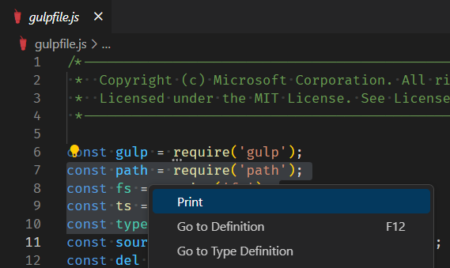

1. Apri un file per la modifica e metti a fuoco l'editor. 
2. Crea una selezione su più righe.
3. Attivare la stampa in uno dei seguenti modi.
	- Fare clic sull'icona Stampa nella barra degli strumenti.
	- Fai clic con il pulsante destro del mouse sul documento e scegli "Stampa" dal menu contestuale.

I numeri di riga vengono mantenuti. Ad esempio, nell'illustrazione vengono selezionate le linee da 7 a 10. Verranno stampate solo queste righe e saranno numerate da 7 a 10.