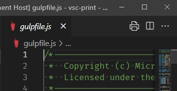

1. Obriu un fitxer per editar-lo i enfoceu l'editor. Això farà que la icona d'impressió aparegui a la barra d'eines.
2. No creeu una selecció de text de diverses línies. Si n'hi ha, elimineu-lo. 
3. Activeu la impressió d'una de les maneres següents.
	- Feu clic a la icona Imprimeix a la barra d'eines.
	- Feu clic amb el botó dret sobre el document i trieu "Imprimeix" al menú contextual.

Quan imprimiu un fitxer obert, s'imprimeix el contingut de la memòria intermèdia d'edició. Això pot diferir del fitxer del disc. Podeu imprimir un fitxer que no s'ha desat mai.