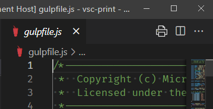

1. 편집할 파일을 열고 편집기에 초점을 맞춥니다. 이렇게 하면 인쇄 아이콘이 도구 모음에 나타납니다.
2. 여러 줄 텍스트 선택을 만들지 마십시오. 존재하는 경우 제거하십시오. 
3. 다음 방법 중 하나로 인쇄를 트리거합니다.
	- 도구 모음에서 인쇄 아이콘을 클릭합니다.
	- 문서를 마우스 오른쪽 버튼으로 클릭하고 상황에 맞는 메뉴에서 '인쇄'를 선택합니다.

열려 있는 파일을 인쇄하면 편집 버퍼의 내용이 인쇄됩니다. 이는 디스크의 파일과 다를 수 있습니다. 저장되지 않은 파일을 인쇄할 수 있습니다.