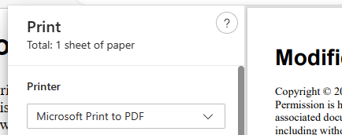

Markdown се отпечатва форматиран по подразбиране. Не са необходими действия, за да се предизвика това. 

1. Задействайте печата по един от следните начини.
	- Кликнете върху иконата Печат в лентата с инструменти.
	- Щракнете с десния бутон върху документа и изберете "Печат" от контекстното меню.
2. Изберете PDF принтер в диалоговия прозорец за печат на вашия браузър. 

Диалоговият прозорец за печат на браузъра също така контролира размера на хартията, ориентацията, полетата и дали да се показват горните и долните колонтитули. Съдържанието автоматично ще се преобразува, за да отговаря на промените в формата, ориентацията и полетата на хартията. Контролът на горните и долните колонтитули и тяхното съдържание е специфичен за браузъра. Консултирайте се с документацията на браузъра за подробности.