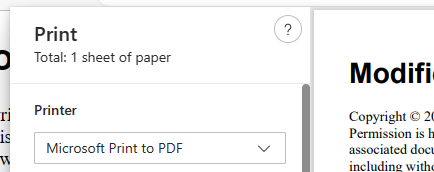

Markdown se imprime con formato predeterminado. No se requiere ninguna acción para causar esto. 

1. Desencadene la impresión de una de las siguientes maneras.
	- Haga clic en el icono Imprimir en la barra de herramientas.
	- Haga clic con el botón derecho del ratón en el documento y elija "Imprimir" en el menú contextual.
2. Elija una impresora PDF en el cuadro de diálogo de impresión de su navegador. 

El cuadro de diálogo de impresión del navegador también controla el tamaño del papel, la orientación, los márgenes y si se muestran los encabezados y pies de página. El contenido se redistribuirá automáticamente para adaptarse a los cambios en el tamaño, la orientación y los márgenes del papel. El control de los encabezados, pies de página y su contenido es específico del navegador. Consulte la documentación del navegador para obtener más información.