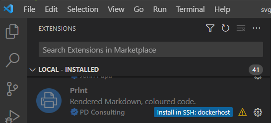

1. Telepítse a Nyomtatást a távoli gazdagépre a jelvényre kattintva (lásd az ábrát) 
2. Használja a Nyomtatás normál módon

Számos Markdown-bővítmény nincs konfigurálva a távoli gazdagépen való futtatásra. Ez elérhetetlenné teszi őket, ha a Markdownt távoli munkaterületről nyomtatja. Ha úgy találja, hogy egy Markdown-bővítmény helyileg működik, de távolról nem, kérje meg a szerzőt, hogy adja hozzá ezt a legfelső szintű kulcsot

"extensionKind": ["munkaterület"],

a jogsértő kiterjesztés "package.json" fájljához.