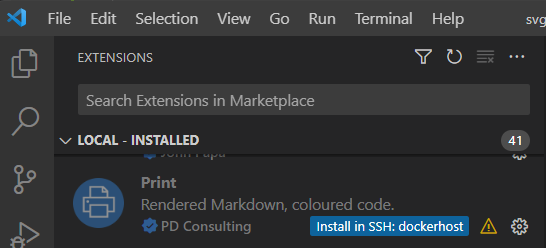

1. Instale o Print no host remoto clicando no emblema (veja a ilustração) 
2. Use Imprimir normalmente

Muitas extensões Markdown não estão configuradas para serem executadas no host remoto. Isso os torna indisponíveis ao imprimir Markdown de um workspace remoto. Se você achar que uma extensão Markdown funciona localmente, mas não remotamente, peça ao autor para adicionar essa chave de nível superior

"extensionKind": ["espaço de trabalho"],

ao arquivo 'package.json' da extensão ofensiva.